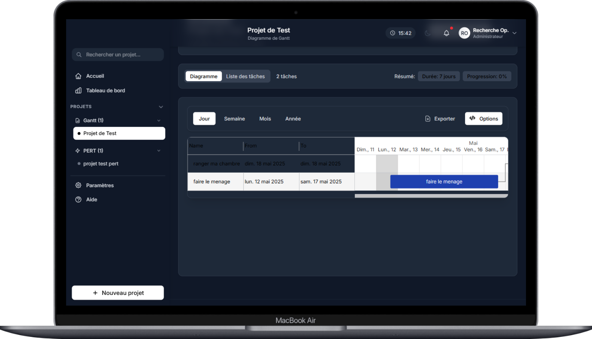
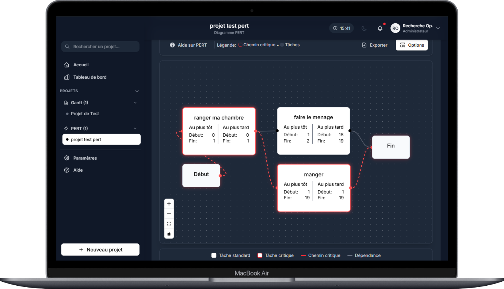

# Projet de Diagrammes Gantt et PERT

## Aperçu


Ce projet est une application web moderne permettant de créer, visualiser et gérer des diagrammes Gantt et PERT pour la planification de projets. Développé avec React et TypeScript, il offre une interface utilisateur intuitive et réactive pour la gestion de projets et la visualisation des dépendances entre tâches.

**Auteur :** FOX  
**Repository :** [https://github.com/RechercheOP/frontendROProjetDiagrammes](https://github.com/RechercheOP/frontendROProjetDiagrammes)

## Table des matières

1. [Installation](#installation)
2. [Configuration](#configuration)
3. [Structure du projet](#structure-du-projet)
4. [Fonctionnalités principales](#fonctionnalités-principales)
5. [Architecture technique](#architecture-technique)
6. [Services](#services)
7. [Composants principaux](#composants-principaux)
8. [Hooks personnalisés](#hooks-personnalisés)
9. [Contextes](#contextes)
10. [Modèles de données](#modèles-de-données)
11. [Algorithmes](#algorithmes)
12. [Utilitaires](#utilitaires)
13. [Gestion des thèmes](#gestion-des-thèmes)
14. [Exportation](#exportation)
15. [Tests](#tests)
16. [Déploiement](#déploiement)
17. [Problèmes connus](#problèmes-connus)
18. [Dépendances principales](#dépendances-principales)
19. [Licences](#licences)
20. [Contribution](#contribution)

## Installation

### Prérequis

- Node.js (v16.0 ou supérieure)
- npm (v7.0 ou supérieure) ou yarn (v1.22 ou supérieure)
- Un navigateur web moderne (Chrome, Firefox, Safari, Edge)

### Étapes d'installation

1. Clonez le repository :
   ```bash
   git clone https://github.com/RechercheOP/frontendROProjetDiagrammes.git
   cd frontendROProjetDiagrammes
   ```

2. Installez les dépendances :
   ```bash
   npm install
   # ou
   yarn install
   ```

3. Lancez le serveur de développement :
   ```bash
   npm run dev
   # ou
   yarn dev
   ```

4. Ouvrez votre navigateur à l'URL : `http://localhost:5173/`

## Configuration

Le projet utilise Vite comme outil de build et de développement. Les principales configurations sont :

### Vite Configuration (`vite.config.ts`)

```typescript
import { defineConfig } from 'vite';
import react from '@vitejs/plugin-react';
import path from 'path';

export default defineConfig({
  plugins: [react()],
  resolve: {
    alias: {
      '@': path.resolve(__dirname, './src'),
    },
  },
  server: {
    port: 5173,
    open: true,
  },
  build: {
    outDir: 'dist',
    sourcemap: true,
  },
});
```

### TypeScript Configuration (`tsconfig.json`)

Le projet utilise TypeScript pour un typage statique, améliorant la robustesse du code et l'expérience de développement.

## Structure du projet

```
frontendROProjetDiagrammes/
├── node_modules/          # Dépendances installées
├── public/                # Fichiers statiques accessibles publiquement
├── screens/               # Captures d'écran de l'application
├── src/                   # Code source de l'application
│   ├── components/        # Composants React réutilisables
│   │   ├── common/        # Composants génériques (buttons, inputs, etc.)
│   │   ├── gantt/         # Composants spécifiques aux diagrammes Gantt
│   │   ├── layout/        # Composants de structure (header, sidebar, etc.)
│   │   └── pert/          # Composants spécifiques aux diagrammes PERT
│   ├── contexts/          # Contextes React pour la gestion d'état global
│   ├── hooks/             # Hooks personnalisés
│   ├── pages/             # Composants de page
│   ├── services/          # Services et logique métier
│   │   ├── algorithm/     # Algorithmes pour les calculs de chemins critiques, etc.
│   │   ├── chart/         # Services pour les diagrammes Gantt et PERT
│   │   ├── export/        # Services d'exportation (PNG, JPEG, SVG)
│   │   └── localStorage/  # Services de persistance locale
│   ├── styles/            # Fichiers CSS/SCSS globaux
│   ├── types/             # Types et interfaces TypeScript
│   ├── utils/             # Fonctions utilitaires
│   ├── App.css            # Styles pour le composant App
│   ├── App.tsx            # Composant racine de l'application
│   ├── index.css          # Styles globaux
│   ├── main.tsx           # Point d'entrée de l'application
│   └── vite-env.d.ts      # Types pour l'environnement Vite
├── .gitignore             # Fichiers ignorés par Git
├── index.html             # Page HTML principale
├── package.json           # Configuration du projet et dépendances
├── README.md              # Documentation du projet
├── tailwind.config.js     # Configuration de Tailwind CSS
├── tsconfig.json          # Configuration TypeScript
└── vite.config.ts         # Configuration Vite
```

## Fonctionnalités principales

### 1. Gestion de projets

- Création de nouveaux projets
- Édition des détails du projet
- Suppression de projets
- Tableau de bord avec visualisation des statistiques des projets


### 2. Diagramme de Gantt

- Création et visualisation des diagrammes de Gantt
- Gestion des tâches (ajout, édition, suppression)
- Configuration des dépendances entre tâches
- Affichage du chemin critique
- Plusieurs modes d'affichage (jour, semaine, mois)
- Personnalisation des couleurs et styles



### 3. Diagramme PERT

- Visualisation des tâches sous forme de réseau PERT
- Mise en évidence du chemin critique
- Interaction : déplacement des nœuds, zoom, panoramique
- Affichage des informations détaillées sur les tâches



### 4. Fonctionnalités transversales

- Mode sombre/clair
- Exportation en formats PNG, JPEG et SVG
- Persistance des données (LocalStorage)
- Interface utilisateur réactive
- Validation des données

## Architecture technique

L'application est construite selon une architecture moderne basée sur des composants React, utilisant plusieurs patterns de développement pour une meilleure maintenabilité et extensibilité :

### Composants

Utilisation intensive de composants fonctionnels React avec hooks pour une gestion d'état efficace et une meilleure lisibilité.

### Gestion d'état

- **Locale** : `useState` pour l'état interne des composants
- **Globale** : Contextes React pour le partage d'état entre composants
- **Persistante** : Services de stockage local pour persister les données utilisateur

### Routing

Utilisation de `react-router-dom` pour la navigation entre les pages et la gestion des URL.

### Styling

Approche basée sur Tailwind CSS pour un développement rapide et une personnalisation facile, combinée avec des animations fluides via Framer Motion.

## Services

### 1. Service de stockage local (`localStorage`)

Le service de stockage local gère la persistance des données dans le navigateur utilisateur.

**Fichier principal: `src/services/localStorage/projectStorage.ts`**

```typescript
/**
 * Service de gestion du stockage local pour les projets
 * Ce service permet de sauvegarder, récupérer, modifier et supprimer des projets
 */

import { Project, Task } from '../../types/models';
import { v4 as uuidv4 } from 'uuid';

// Clé utilisée pour stocker les projets dans le localStorage
const STORAGE_KEY = 'gantt-pert-projects';

/**
 * Récupère tous les projets stockés
 * @returns Liste de tous les projets
 */
export const getAllProjects = (): Project[] => {
  const data = localStorage.getItem(STORAGE_KEY);
  if (!data) return [];
  try {
    return JSON.parse(data);
  } catch (error) {
    console.error('Erreur lors de la récupération des projets:', error);
    return [];
  }
};

/**
 * Récupère un projet spécifique par son ID
 * @param id ID du projet à récupérer
 * @returns Le projet s'il existe, null sinon
 */
export const getProject = (id: string): Project | null => {
  const projects = getAllProjects();
  const project = projects.find(p => p.id === id);
  return project || null;
};

/**
 * Sauvegarde un nouveau projet ou met à jour un existant
 * @param project Projet à sauvegarder
 * @returns Le projet sauvegardé
 */
export const saveProject = (project: Project): Project => {
  const projects = getAllProjects();
  
  const now = new Date().toISOString();
  
  // Si c'est un nouveau projet, ajouter l'ID et les dates
  if (!project.id) {
    project.id = uuidv4();
    project.createdAt = now;
  }
  
  // Mettre à jour la date de modification
  project.updatedAt = now;
  
  // Trouver l'index du projet s'il existe déjà
  const existingIndex = projects.findIndex(p => p.id === project.id);
  
  if (existingIndex >= 0) {
    // Mettre à jour le projet existant
    projects[existingIndex] = project;
  } else {
    // Ajouter le nouveau projet
    projects.push(project);
  }
  
  // Sauvegarder dans le localStorage
  localStorage.setItem(STORAGE_KEY, JSON.stringify(projects));
  
  return project;
};

/**
 * Supprime un projet par son ID
 * @param id ID du projet à supprimer
 * @returns true si le projet a été supprimé, false sinon
 */
export const deleteProject = (id: string): boolean => {
  const projects = getAllProjects();
  const filteredProjects = projects.filter(p => p.id !== id);
  
  if (filteredProjects.length < projects.length) {
    localStorage.setItem(STORAGE_KEY, JSON.stringify(filteredProjects));
    return true;
  }
  
  return false;
};

// ... autres fonctions utilitaires pour la gestion des tâches
```

### 2. Service de diagramme Gantt (`ganttService.ts`)

Ce service gère la conversion des données du projet en format compatible avec la bibliothèque Gantt, ainsi que les calculs associés.

**Fichier principal: `src/services/chart/ganttService.ts`**

```typescript
/**
 * Service pour gérer les diagrammes Gantt
 * Ce service fournit des méthodes pour manipuler et calculer les données des diagrammes Gantt
 */

import { Task, Project } from '../../types/models';
import { format, addDays, differenceInDays, parseISO, isValid } from 'date-fns';

// Interface pour les tâches adaptée au format requis par gantt-task-react
export interface GanttTask {
    id: string;
    name: string;
    start: Date;
    end: Date;
    progress: number;
    dependencies: string[];
    type: 'task' | 'milestone' | 'project';
    isComplete?: boolean;
    styles?: {
        backgroundColor?: string;
        progressColor?: string;
        backgroundSelectedColor?: string;
    };
    project?: string;
    hideChildren?: boolean;
    displayOrder?: number;
}

// Fonction pour assigner des couleurs différentes aux tâches
const getColorForTask = (taskIndex: number): string => {
    const colors = [
        '#1e40af', '#1d4ed8', '#2563eb', '#3b82f6',
        '#0f766e', '#0d9488', '#14b8a6', '#0891b2',
        '#4338ca', '#6366f1', '#7c3aed', '#8b5cf6',
        '#9333ea', '#d946ef', '#c026d3', '#db2777',
        '#ec4899', '#f43f5e', '#e11d48', '#be123c',
        '#9f1239', '#ea580c', '#f97316', '#eab308',
    ];
    
    return colors[taskIndex % colors.length];
};

// Helper to adjust color brightness
const adjustColorBrightness = (hex: string, percent: number): string => {
    let r = parseInt(hex.substring(1, 3), 16);
    let g = parseInt(hex.substring(3, 5), 16);
    let b = parseInt(hex.substring(5, 7), 16);
    
    r = Math.max(0, Math.min(255, r + percent));
    g = Math.max(0, Math.min(255, g + percent));
    b = Math.max(0, Math.min(255, b + percent));
    
    return `#${((1 << 24) + (r << 16) + (g << 8) + b).toString(16).slice(1)}`;
};

// Convert Project tasks to format expected by gantt-task-react
export const convertToGanttTasks = (project: Project): GanttTask[] => {
    // Vérifier d'abord que le projet a des tâches
    if (!project.tasks || project.tasks.length === 0) {
        return [];
    }

    // Copier les tâches pour éviter de modifier l'original
    const tasksCopy = JSON.parse(JSON.stringify(project.tasks)) as Task[];

    // Construire un graph de dépendance
    const taskMap = new Map<string, Task>();
    tasksCopy.forEach(task => taskMap.set(task.id, task));

    // Attribuer une date de début par défaut aux tâches sans dépendances
    // Utilisons la date actuelle comme date de début par défaut
    const today = new Date();

    // Fonction pour obtenir la date de début d'une tâche
    const getTaskStartDate = (taskId: string, visited = new Set<string>()): Date => {
        // Détecter les dépendances circulaires
        if (visited.has(taskId)) {
            console.error("Dépendance circulaire détectée pour la tâche", taskId);
            return today;
        }

        const task = taskMap.get(taskId);
        if (!task) {
            console.error("Tâche non trouvée:", taskId);
            return today;
        }

        // Si la tâche n'a pas de dépendances, utiliser sa date de début ou aujourd'hui
        if (!task.dependencies || task.dependencies.length === 0) {
            return today;
        }

        // Sinon, calculer la date de début en fonction des dépendances
        let latestEndDate = today;

        // Marquer cette tâche comme visitée pour détecter les cycles
        visited.add(taskId);

        for (const depId of task.dependencies) {
            const depTask = taskMap.get(depId);
            if (!depTask) continue;

            // Récursivement obtenir la date de début de la dépendance
            const depStartDate = getTaskStartDate(depId, new Set(visited));

            // Calculer la date de fin de la dépendance
            const depEndDate = new Date(depStartDate);
            depEndDate.setDate(depEndDate.getDate() + (depTask.duration || 1) - 1);

            // Mettre à jour la date de fin la plus tardive
            if (depEndDate > latestEndDate) {
                latestEndDate = new Date(depEndDate);
            }
        }

        // La tâche commence le jour suivant la fin de la dernière dépendance
        const startDate = new Date(latestEndDate);
        startDate.setDate(startDate.getDate() + 1);

        // Mettre à jour la date de début de la tâche
        task.start = startDate;

        // Mettre à jour la date de fin de la tâche
        const endDate = new Date(startDate);
        endDate.setDate(endDate.getDate() + (task.duration || 1) - 1);
        task.end = endDate;

        return startDate;
    };

    // Calculer les dates pour toutes les tâches
    for (const task of tasksCopy) {
        try {
            // Pour s'assurer que les dates sont bien des objets Date
            const startDate = getTaskStartDate(task.id);
            task.start = startDate;
            
            const endDate = new Date(startDate);
            endDate.setDate(endDate.getDate() + (task.duration || 1) - 1);
            task.end = endDate;
        } catch (error) {
            console.error(`Erreur lors du calcul des dates pour la tâche ${task.id}:`, error);
            
            // Valeurs par défaut en cas d'erreur
            task.start = new Date();
            const endDefault = new Date();
            endDefault.setDate(endDefault.getDate() + (task.duration || 1) - 1);
            task.end = endDefault;
        }
    }

    // Convertir les tâches au format gantt-task-react
    return tasksCopy.map((task, index) => {
        try {
            // S'assurer que start et end sont des objets Date valides
            let startDate = task.start;
            let endDate = task.end;
            
            // Convertir les chaînes en objets Date si nécessaire
            if (typeof startDate === 'string') {
                startDate = new Date(startDate);
            }
            
            if (typeof endDate === 'string') {
                endDate = new Date(endDate);
            }
            
            // Vérifier si les dates sont valides
            if (!(startDate instanceof Date && !isNaN(startDate.getTime()))) {
                console.warn(`Date de début invalide pour la tâche ${task.id}, utilisation de la date par défaut`);
                startDate = new Date();
            }
            
            if (!(endDate instanceof Date && !isNaN(endDate.getTime()))) {
                console.warn(`Date de fin invalide pour la tâche ${task.id}, utilisation de la date par défaut`);
                endDate = new Date();
                endDate.setDate(endDate.getDate() + (task.duration || 1) - 1);
            }
            
            // Utiliser une couleur unique pour chaque tâche
            const taskColor = task.color || getColorForTask(index);
            
            return {
                id: task.id,
                name: task.name,
                start: startDate,
                end: endDate,
                progress: task.progress / 100, // Convert percentage to decimal
                type: 'task',
                dependencies: task.dependencies,
                displayOrder: index,
                styles: {
                    backgroundColor: taskColor,
                    progressColor: '#ffffff',
                    backgroundSelectedColor: adjustColorBrightness(taskColor, -20)
                }
            };
        } catch (error) {
            console.error(`Erreur lors de la conversion de la tâche ${task.id}:`, error);
            
            // Renvoyer une tâche par défaut en cas d'erreur
            const defaultStart = new Date();
            const defaultEnd = new Date();
            defaultEnd.setDate(defaultEnd.getDate() + (task.duration || 1) - 1);
            
            return {
                id: task.id,
                name: task.name || "Tâche sans nom",
                start: defaultStart,
                end: defaultEnd,
                progress: 0,
                type: 'task',
                dependencies: [],
                displayOrder: index,
                styles: {
                    backgroundColor: getColorForTask(index),
                    progressColor: '#ffffff',
                    backgroundSelectedColor: '#000000'
                }
            };
        }
    });
};

// ... Autres fonctions utilitaires pour les calculs de durée, validation, vérification des dépendances circulaires, etc.
```

### 3. Service de diagramme PERT (`pertService.ts`)

Ce service gère la conversion des données du projet en format compatible avec la bibliothèque ReactFlow, ainsi que le positionnement des nœuds et la mise en évidence du chemin critique.

**Fichier principal: `src/services/chart/pertService.ts`**

```typescript
/**
 * Service pour gérer les diagrammes PERT
 * Ce service fournit des méthodes pour générer et manipuler les graphes PERT
 */

import { v4 as uuidv4 } from 'uuid';
import { Project, Task } from '../../types/models';
import { Position } from 'reactflow';
import { calculateCriticalPath } from '../algorithm/criticalPath';

// Interfaces pour les graphes PERT
export interface PertNode {
    id: string;
    type?: string;
    position: { x: number; y: number };
    label: string;
    data: {
        task?: Task;
        es?: number; // Earliest Start
        ef?: number; // Earliest Finish
        ls?: number; // Latest Start
        lf?: number; // Latest Finish
        slack?: number; // Slack time
    };
    style?: Record<string, any>;
}

export interface PertEdge {
    id: string;
    source: string;
    target: string;
    label?: string;
    animated?: boolean;
    style?: Record<string, any>;
}

export interface PertGraph {
    nodes: PertNode[];
    edges: PertEdge[];
    criticalPath: string[];
}

/**
 * Convertit un projet en graphe PERT
 * @param project Projet à convertir
 * @returns Graphe PERT (nœuds et arêtes)
 */
export const convertToPertGraph = (project: Project): PertGraph => {
    if (!project || !project.tasks || project.tasks.length === 0) {
        return { nodes: [], edges: [], criticalPath: [] };
    }

    // Calculer le chemin critique
    const { criticalPath, taskValues } = calculateCriticalPath(project.tasks);

    // Créer un nœud de départ
    const startNode: PertNode = {
        id: 'start',
        type: 'start',
        position: { x: 0, y: 200 },
        label: 'Début',
        data: {},
        style: {
            background: '#e5e7eb',
            color: '#111827',
            borderRadius: '4px',
            border: '1px solid #d1d5db',
            padding: '10px 15px',
            fontWeight: 'bold',
            width: 80,
            textAlign: 'center'
        }
    };

    // Créer un nœud de fin
    const endNode: PertNode = {
        id: 'end',
        type: 'end',
        position: { x: 800, y: 200 },
        label: 'Fin',
        data: {},
        style: {
            background: '#e5e7eb',
            color: '#111827',
            borderRadius: '4px',
            border: '1px solid #d1d5db',
            padding: '10px 15px',
            fontWeight: 'bold',
            width: 80,
            textAlign: 'center'
        }
    };

    // Créer les nœuds pour chaque tâche
    const pertNodes: PertNode[] = project.tasks.map((task, index) => {
        // Trouver les valeurs calculées pour cette tâche
        const taskValue = taskValues.find(tv => tv.id === task.id);

        return {
            id: task.id,
            type: 'task',
            position: { 
                x: 250 + Math.floor(index / 3) * 250, 
                y: 100 + (index % 3) * 150 
            },
            label: task.name,
            data: {
                task,
                es: taskValue?.es || 0,
                ef: taskValue?.ef || task.duration,
                ls: taskValue?.ls || 0,
                lf: taskValue?.lf || task.duration,
                slack: taskValue?.slack || 0,
            },
            style: {
                background: criticalPath.includes(task.id) ? '#fef2f2' : '#f9fafb',
                color: '#111827',
                borderRadius: '4px',
                border: criticalPath.includes(task.id) ? '2px solid #ff4d4f' : '1px solid #e5e7eb',
                padding: '10px 15px',
                minWidth: 180,
                maxWidth: 250,
            }
        };
    });

    // Ajouter les nœuds de début et de fin
    pertNodes.push(startNode, endNode);

    // Créer les arêtes pour les dépendances entre tâches
    let pertEdges: PertEdge[] = [];

    // Connecter les tâches sans dépendances au nœud de début
    const tasksWithoutDependencies = project.tasks.filter(task => 
        task.dependencies.length === 0
    );

    tasksWithoutDependencies.forEach(task => {
        pertEdges.push({
            id: `start-${task.id}`,
            source: 'start',
            target: task.id,
            animated: criticalPath.includes(task.id),
            style: {
                stroke: criticalPath.includes(task.id) ? '#ff4d4f' : '#9ca3af',
                strokeWidth: criticalPath.includes(task.id) ? 2 : 1,
            }
        });
    });

    // Connecter les tâches qui ne sont pas des dépendances aux autres au nœud de fin
    const taskIds = project.tasks.map(t => t.id);
    const tasksWithoutDependents = project.tasks.filter(task =>
        !project.tasks.some(t => t.dependencies.includes(task.id))
    );

    tasksWithoutDependents.forEach(task => {
        pertEdges.push({
            id: `${task.id}-end`,
            source: task.id,
            target: 'end',
            animated: criticalPath.includes(task.id),
            style: {
                stroke: criticalPath.includes(task.id) ? '#ff4d4f' : '#9ca3af',
                strokeWidth: criticalPath.includes(task.id) ? 2 : 1,
            }
        });
    });

    // Connecter les tâches selon leurs dépendances
    project.tasks.forEach(task => {
        task.dependencies.forEach(depId => {
            if (taskIds.includes(depId)) {
                pertEdges.push({
                    id: `${depId}-${task.id}`,
                    source: depId,
                    target: task.id,
                    label: `${task.duration}j`,
                    animated: criticalPath.includes(depId) && criticalPath.includes(task.id),
                    style: {
                        stroke: criticalPath.includes(depId) && criticalPath.includes(task.id) ? '#ff4d4f' : '#9ca3af',
                        strokeWidth: criticalPath.includes(depId) && criticalPath.includes(task.id) ? 2 : 1,
                    }
                });
            }
        });
    });

    // Optimiser le positionnement des nœuds
    const positionedNodes = optimizeNodePositions(pertNodes, pertEdges);

    return {
        nodes: positionedNodes,
        edges: pertEdges,
        criticalPath
    };
};

/**
 * Optimise le positionnement des nœuds pour une meilleure visualisation
 * Utilise un placement topologique basé sur les niveaux de dépendances
 */
const optimizeNodePositions = (nodes: PertNode[], edges: PertEdge[]): PertNode[] => {
    // Créer un graphe orienté
    const graph: Record<string, string[]> = {};
    nodes.forEach(node => {
        graph[node.id] = [];
    });

    edges.forEach(edge => {
        if (graph[edge.source]) {
            graph[edge.source].push(edge.target);
        }
    });

    // Calculer le niveau de chaque nœud (profondeur depuis le nœud de départ)
    const levels: Record<string, number> = {};
    const visited = new Set<string>();

    const calculateLevel = (nodeId: string, level = 0) => {
        if (visited.has(nodeId)) return;
        visited.add(nodeId);

        levels[nodeId] = Math.max(levels[nodeId] || 0, level);

        graph[nodeId]?.forEach(targetId => {
            calculateLevel(targetId, level + 1);
        });
    };

    // Commencer par le nœud de départ
    calculateLevel('start');

    // Compter les nœuds par niveau
    const nodesPerLevel: Record<number, string[]> = {};
    Object.entries(levels).forEach(([nodeId, level]) => {
        if (!nodesPerLevel[level]) {
            nodesPerLevel[level] = [];
        }
        nodesPerLevel[level].push(nodeId);
    });

    // Calculer les positions X et Y basées sur les niveaux
    return nodes.map(node => {
        const level = levels[node.id] || 0;
        const nodesAtLevel = nodesPerLevel[level] || [];
        const position = nodesAtLevel.indexOf(node.id);
        const totalNodes = nodesAtLevel.length;

        const xGap = 200; // Espacement horizontal
        const x = level * xGap + 100;

        // Distribution verticale équilibrée
        const totalHeight = 600;
        const margin = 80;
        const availableHeight = totalHeight - 2 * margin;
        const yStep = totalNodes > 1 ? availableHeight / (totalNodes - 1) : 0;
        const y = totalNodes > 1 ? margin + position * yStep : totalHeight / 2;

        return {
            ...node,
            position: { x, y }
        };
    });
};

/**
 * Valide un projet PERT
 * @param project Projet à valider
 * @returns Liste d'erreurs (vide si le projet est valide)
 */
export const validatePertProject = (project: Project): string[] => {
    const errors: string[] = [];
    
    // Vérifier que le projet a un nom
    if (!project.name || project.name.trim() === '') {
        errors.push('Le projet doit avoir un nom.');
    }
    
    // Vérifier les tâches
    if (!project.tasks || project.tasks.length === 0) {
        errors.push('Le projet doit contenir au moins une tâche.');
    } else {
        // Vérifier chaque tâche
        project.tasks.forEach((task, index) => {
            // Chaque tâche doit avoir un nom
            if (!task.name || task.name.trim() === '') {
                errors.push(`La tâche à l'index ${index} doit avoir un nom.`);
            }
            
            // Chaque tâche doit avoir une durée
            if (task.duration <= 0) {
                errors.push(`La tâche "${task.name}" doit avoir une durée positive.`);
            }
            
            // Vérifier que les dépendances existent
            const taskIds = project.tasks.map(t => t.id);
            task.dependencies.forEach(depId => {
                if (!taskIds.includes(depId)) {
                    errors.push(`La tâche "${task.name}" a une dépendance vers une tâche inexistante.`);
                }
            });
        });
        
        // Vérifier les dépendances circulaires
        if (hasCircularDependencies(project.tasks)) {
            errors.push('Le projet contient des dépendances circulaires.');
        }
    }
    
    return errors;
};

/**
 * Vérifie si le projet contient des dépendances circulaires
 * @param tasks Liste des tâches à vérifier
 * @returns true si des dépendances circulaires sont détectées
 */
export const hasCircularDependencies = (tasks: Task[]): boolean => {
    const graph: Record<string, string[]> = {};
    
    // Construire le graphe
    tasks.forEach(task => {
        graph[task.id] = task.dependencies || [];
    });
    
    // DFS pour détecter les cycles
    const visited = new Set<string>();
    const recStack = new Set<string>();
    
    const hasCycle = (node: string): boolean => {
        if (!visited.has(node)) {
            visited.add(node);
            recStack.add(node);
            
            for (const neighbor of graph[node] || []) {
                if (!visited.has(neighbor) && hasCycle(neighbor)) {
                    return true;
                } else if (recStack.has(neighbor)) {
                    return true;
                }
            }
        }
        recStack.delete(node);
        return false;
    };
    
    // Vérifier chaque nœud
    for (const task of tasks) {
        if (hasCycle(task.id)) {
            return true;
        }
    }
    
    return false;
};
```

### 4. Service de calcul du chemin critique (`criticalPath.ts`)

Ce service implémente l'algorithme de calcul du chemin critique pour les diagrammes Gantt et PERT.

**Fichier principal: `src/services/algorithm/criticalPath.ts`**

```typescript
/**
 * Service pour calculer le chemin critique dans les diagrammes Gantt et PERT
 */

import { Task } from '../../types/models';
import { differenceInDays, parseISO } from 'date-fns';

// Interface pour stocker les valeurs forward/backward pass
interface TaskValues {
    id: string;
    es: number; // Earliest Start
    ef: number; // Earliest Finish
    ls: number; // Latest Start
    lf: number; // Latest Finish
    slack: number;
    isCritical: boolean;
}

/**
 * Calculer le chemin critique pour les tâches d'un projet
 * @param tasks Liste des tâches
 * @returns Un objet contenant le chemin critique et des informations supplémentaires
 */
export const calculateCriticalPath = (tasks: Task[]): {
    criticalPath: string[];
    taskValues: TaskValues[];
    projectDuration: number;
} => {
    // Créer une copie des tâches pour les manipuler
    const tasksCopy = [...tasks];

    // S'assurer que toutes les tâches ont une durée
    tasksCopy.forEach(task => {
        if (!task.duration) {
            // Calculer la durée si elle n'est pas définie
            const start = typeof task.start === 'string' ? parseISO(task.start) : task.start;
            const end = typeof task.end === 'string' ? parseISO(task.end) : task.end;
            task.duration = differenceInDays(end, start) + 1;
        }
    });

    // Créer un mapping des tâches pour un accès facile
    const taskMap = new Map<string, Task>();
    tasksCopy.forEach(task => taskMap.set(task.id, task));

    // Identifier les tâches de départ (sans dépendances)
    const startTasks = tasksCopy.filter(task => task.dependencies.length === 0);

    // Initialiser les valeurs de chaque tâche
    const taskValues = new Map<string, TaskValues>();
    tasksCopy.forEach(task => {
        taskValues.set(task.id, {
            id: task.id,
            es: 0,
            ef: 0,
            ls: 0,
            lf: 0,
            slack: 0,
            isCritical: false
        });
    });

    // Forward pass (calculer les dates au plus tôt)
    forwardPass(tasksCopy, taskValues, taskMap);

    // Trouver la durée du projet (dernier EF)
    let projectDuration = 0;
    taskValues.forEach(value => {
        if (value.ef > projectDuration) {
            projectDuration = value.ef;
        }
    });

    // Backward pass (calculer les dates au plus tard)
    backwardPass(tasksCopy, taskValues, taskMap, projectDuration);

    // Calculer la marge et identifier les tâches critiques
    const criticalTasks: string[] = [];
    taskValues.forEach((value, taskId) => {
        // Calculer la marge (slack)
        value.slack = value.ls - value.es;

        // Si la marge est nulle, la tâche est critique
        if (value.slack === 0) {
            value.isCritical = true;
            criticalTasks.push(taskId);
        }
    });

    // Trier les tâches critiques pour former le chemin critique
    const criticalPath = sortCriticalTasks(criticalTasks, taskMap);

    // Convertir la Map en array pour le retour
    const taskValuesArray = Array.from(taskValues.values());

    return {
        criticalPath,
        taskValues: taskValuesArray,
        projectDuration
    };
};

/**
 * Forward pass (calculer ES et EF)
 */
const forwardPass = (
    tasks: Task[],
    taskValues: Map<string, TaskValues>,
    taskMap: Map<string, Task>
): void => {
    // Créer un graphe orienté pour représenter les dépendances
    const graph = new Map<string, string[]>();
    tasks.forEach(task => {
        // Pour chaque tâche, enregistrer ses successeurs
        task.dependencies.forEach(depId => {
            if (!graph.has(depId)) {
                graph.set(depId, []);
            }
            graph.get(depId)!.push(task.id);
        });

        // S'assurer que chaque tâche a une entrée dans le graphe
        if (!graph.has(task.id)) {
            graph.set(task.id, []);
        }
    });

    // Calculer les degrés d'entrée pour chaque tâche
    const inDegree = new Map<string, number>();
    tasks.forEach(task => {
        inDegree.set(task.id, task.dependencies.length);
    });

    // File d'attente pour le tri topologique
    const queue: string[] = [];

    // Commencer par les tâches sans dépendances
    tasks.forEach(task => {
        if (task.dependencies.length === 0) {
            queue.push(task.id);
            const value = taskValues.get(task.id)!;
            value.es = 0;
            value.ef = task.duration;
        }
    });

    // Traiter les tâches dans l'ordre topologique
    while (queue.length > 0) {
        const taskId = queue.shift()!;
        const successors = graph.get(taskId) || [];

        // Mettre à jour ES et EF pour chaque successeur
        for (const succId of successors) {
            const succTask = taskMap.get(succId)!;
            const succValue = taskValues.get(succId)!;
            const currentValue = taskValues.get(taskId)!;

            // ES est le maximum de EF de tous les prédécesseurs
            if (currentValue.ef > succValue.es) {
                succValue.es = currentValue.ef;
                succValue.ef = succValue.es + succTask.duration;
            }

            // Réduire le degré d'entrée et ajouter à la queue si tous les prédécesseurs ont été traités
            inDegree.set(succId, inDegree.get(succId)! - 1);
            if (inDegree.get(succId) === 0) {
                queue.push(succId);
            }
        }
    }
};

/**
 * Backward pass (calculer LS et LF)
 */
const backwardPass = (
    tasks: Task[],
    taskValues: Map<string, TaskValues>,
    taskMap: Map<string, Task>,
    projectDuration: number
): void => {
    // Créer un graphe inversé
    const reverseGraph = new Map<string, string[]>();
    tasks.forEach(task => {
        // Pour chaque tâche, enregistrer ses prédécesseurs
        task.dependencies.forEach(depId => {
            if (!reverseGraph.has(task.id)) {
                reverseGraph.set(task.id, []);
            }
            reverseGraph.get(task.id)!.push(depId);
        });

        // S'assurer que chaque tâche a une entrée dans le graphe inversé
        if (!reverseGraph.has(task.id)) {
            reverseGraph.set(task.id, []);
        }
    });

    // Trouver les tâches terminales (celles qui n'ont pas de successeurs)
    const terminalTasks = tasks.filter(task => {
        return !tasks.some(t => t.dependencies.includes(task.id));
    });

    // Initialiser LS et LF pour les tâches terminales
    terminalTasks.forEach(task => {
        const value = taskValues.get(task.id)!;
        value.lf = projectDuration;
        value.ls = value.lf - task.duration;
    });

    // Calculer les degrés de sortie pour chaque tâche
    const outDegree = new Map<string, number>();
    tasks.forEach(task => {
        outDegree.set(task.id, 0);
    });

    tasks.forEach(task => {
        task.dependencies.forEach(depId => {
            outDegree.set(depId, (outDegree.get(depId) || 0) + 1);
        });
    });

    // File d'attente pour le tri topologique inversé
    const queue = terminalTasks.map(task => task.id);

    // Traiter les tâches dans l'ordre topologique inversé
    while (queue.length > 0) {
        const taskId = queue.shift()!;
        const predecessors = reverseGraph.get(taskId) || [];

        // Mettre à jour LS et LF pour chaque prédécesseur
        for (const predId of predecessors) {
            const predTask = taskMap.get(predId)!;
            const predValue = taskValues.get(predId)!;
            const currentValue = taskValues.get(taskId)!;

            // LF est le minimum de LS de tous les successeurs
            if (predValue.lf === 0 || currentValue.ls < predValue.lf) {
                predValue.lf = currentValue.ls;
                predValue.ls = predValue.lf - predTask.duration;
            }

            // Réduire le degré de sortie et ajouter à la queue si tous les successeurs ont été traités
            outDegree.set(predId, outDegree.get(predId)! - 1);
            if (outDegree.get(predId) === 0) {
                queue.push(predId);
            }
        }
    }
};

/**
 * Trier les tâches critiques pour former le chemin critique
 */
const sortCriticalTasks = (
    criticalTasks: string[],
    taskMap: Map<string, Task>
): string[] => {
    // Si aucune tâche critique, retourner un tableau vide
    if (criticalTasks.length === 0) {
        return [];
    }

    // Créer un graphe des tâches critiques
    const criticalGraph = new Map<string, string[]>();
    criticalTasks.forEach(taskId => {
        criticalGraph.set(taskId, []);
    });

    // Remplir le graphe avec les dépendances entre tâches critiques
    criticalTasks.forEach(taskId => {
        const task = taskMap.get(taskId);
        if (!task) return;

        task.dependencies
            .filter(depId => criticalTasks.includes(depId))
            .forEach(depId => {
                if (!criticalGraph.has(depId)) {
                    criticalGraph.set(depId, []);
                }
                criticalGraph.get(depId)!.push(taskId);
            });
    });

    // Trouver les tâches de départ (sans dépendances ou dont les dépendances ne sont pas critiques)
    const startNodes = criticalTasks.filter(taskId => {
        const task = taskMap.get(taskId);
        if (!task) return false;

        return task.dependencies.length === 0 ||
            !task.dependencies.some(depId => criticalTasks.includes(depId));
    });

    // Tri topologique pour ordonner le chemin critique
    const orderedPath: string[] = [];
    const visited = new Set<string>();

    // Fonction DFS pour parcourir le graphe
    const dfs = (taskId: string): void => {
        if (visited.has(taskId)) return;
        visited.add(taskId);

        const successors = criticalGraph.get(taskId) || [];
        for (const succId of successors) {
            dfs(succId);
        }

        orderedPath.unshift(taskId);
    };

    // Parcourir à partir de chaque nœud de départ
    startNodes.forEach(startNode => {
        dfs(startNode);
    });

    return orderedPath;
};
```

### 5. Service d'exportation (`imageExport.ts`)

Ce service permet d'exporter les diagrammes au format PNG, JPEG ou SVG.

**Fichier principal: `src/services/export/imageExport.ts`**

```typescript
/**
 * Service pour exporter les diagrammes au format image
 */

import html2canvas from 'html2canvas';
import { saveAs } from 'file-saver';

/**
 * Exporte le diagramme Gantt au format image
 * @param filename Nom du fichier (sans extension)
 * @param format Format d'exportation (png, jpeg, svg)
 * @returns Promise<void>
 */
export const exportGanttChart = async (
    filename: string = 'gantt-chart',
    format: 'png' | 'jpeg' | 'svg' = 'png'
): Promise<void> => {
    try {
        const chartElement = document.getElementById('gantt-chart-container');
        if (!chartElement) {
            throw new Error("Élément du diagramme Gantt non trouvé dans le DOM");
        }

        const scale = window.devicePixelRatio;
        
        // Capturer le diagramme avec html2canvas
        const canvas = await html2canvas(chartElement, {
            scale: scale,
            useCORS: true,
            allowTaint: true,
            backgroundColor: null,
            logging: false,
        });

        // Générer le blob selon le format demandé
        if (format === 'svg') {
            const svgData = canvasToSVG(canvas);
            const blob = new Blob([svgData], { type: 'image/svg+xml;charset=utf-8' });
            saveAs(blob, `${filename}.svg`);
        } else {
            const mimeType = format === 'jpeg' ? 'image/jpeg' : 'image/png';
            const quality = format === 'jpeg' ? 0.95 : undefined;
            
            canvas.toBlob((blob) => {
                if (blob) {
                    saveAs(blob, `${filename}.${format}`);
                } else {
                    throw new Error("Impossible de générer l'image");
                }
            }, mimeType, quality);
        }
    } catch (error) {
        console.error("Erreur lors de l'exportation du diagramme Gantt:", error);
        throw error;
    }
};

/**
 * Exporte le diagramme PERT au format image
 * @param filename Nom du fichier (sans extension)
 * @param format Format d'exportation (png, jpeg, svg)
 * @returns Promise<void>
 */
export const exportPertChart = async (
    filename: string = 'pert-chart',
    format: 'png' | 'jpeg' | 'svg' = 'png'
): Promise<void> => {
    try {
        const chartElement = document.getElementById('pert-chart-container');
        if (!chartElement) {
            throw new Error("Élément du diagramme PERT non trouvé dans le DOM");
        }

        const scale = window.devicePixelRatio;
        
        // Capturer le diagramme avec html2canvas
        const canvas = await html2canvas(chartElement, {
            scale: scale,
            useCORS: true,
            allowTaint: true,
            backgroundColor: null,
            logging: false,
        });

        // Générer le blob selon le format demandé
        if (format === 'svg') {
            const svgData = canvasToSVG(canvas);
            const blob = new Blob([svgData], { type: 'image/svg+xml;charset=utf-8' });
            saveAs(blob, `${filename}.svg`);
        } else {
            const mimeType = format === 'jpeg' ? 'image/jpeg' : 'image/png';
            const quality = format === 'jpeg' ? 0.95 : undefined;
            
            canvas.toBlob((blob) => {
                if (blob) {
                    saveAs(blob, `${filename}.${format}`);
                } else {
                    throw new Error("Impossible de générer l'image");
                }
            }, mimeType, quality);
        }
    } catch (error) {
        console.error("Erreur lors de l'exportation du diagramme PERT:", error);
        throw error;
    }
};

/**
 * Convertit un canvas en SVG
 * @param canvas Élément canvas à convertir
 * @returns Chaîne SVG
 */
const canvasToSVG = (canvas: HTMLCanvasElement): string => {
    const width = canvas.width;
    const height = canvas.height;
    const ctx = canvas.getContext('2d');
    const imageData = ctx!.getImageData(0, 0, width, height);
    
    // Créer un élément SVG
    const svg = document.createElementNS('http://www.w3.org/2000/svg', 'svg');
    svg.setAttribute('width', width.toString());
    svg.setAttribute('height', height.toString());
    svg.setAttribute('viewBox', `0 0 ${width} ${height}`);
    svg.setAttribute('xmlns', 'http://www.w3.org/2000/svg');
    
    // Ajouter l'image comme élément image dans le SVG
    const image = document.createElementNS('http://www.w3.org/2000/svg', 'image');
    image.setAttribute('width', width.toString());
    image.setAttribute('height', height.toString());
    image.setAttribute('href', canvas.toDataURL('image/png'));
    svg.appendChild(image);
    
    // Convertir l'élément SVG en chaîne XML
    const serializer = new XMLSerializer();
    return serializer.serializeToString(svg);
};
```

## Composants principaux

### 1. Diagramme Gantt (`GanttChart.tsx`)

Ce composant visualise les tâches du projet sous forme de diagramme de Gantt.

**Fichier principal: `src/components/gantt/GanttChart.tsx`**

```typescript
/**
 * Composant principal du diagramme de Gantt
 * Ce composant affiche le diagramme complet avec timeline, tâches et interactions
 */

import React, { useRef, useState, useEffect } from 'react';
import { Gantt, Task, ViewMode } from 'gantt-task-react';
import "gantt-task-react/dist/index.css";
import { motion } from "framer-motion";
import { Project } from '../../types/models';
import { convertToGanttTasks, GanttTask } from '../../services/chart/ganttService';
import { useProjectContext } from '../../contexts/ProjectContext';
import { useTheme } from '../../contexts/ThemeContext';
import GanttToolbar from './GanttToolbar';
import { exportGanttChart } from '../../services/export/imageExport';

// Styles personnalisés pour le diagramme de Gantt
import './GanttChart.css';

interface GanttChartProps {
  projectId?: string;
}

const GanttChart = React.forwardRef<HTMLDivElement, GanttChartProps>((props, ref) => {
  const { projectId } = props;
  const chartRef = useRef<HTMLDivElement>(null);
  const { project } = useProjectContext();
  const { theme } = useTheme();
  
  // États
  const [tasks, setTasks] = useState<Task[]>([]);
  const [viewMode, setViewMode] = useState<ViewMode>(ViewMode.Day);
  const [isLoading, setIsLoading] = useState<boolean>(true);
  const [error, setError] = useState<string | null>(null);

  // Convertir les tâches du projet en format compatible avec gantt-task-react
  useEffect(() => {
    if (project) {
      setIsLoading(true);
      setError(null);
      
      try {
        // Créer un délai artificiel pour s'assurer que le DOM est prêt
        setTimeout(() => {
          try {
            const ganttTasks = convertToGanttTasks(project);
            
            // Vérifier que toutes les dates sont valides
            const allDatesValid = ganttTasks.every(task => 
              task.start instanceof Date && !isNaN(task.start.getTime()) && 
              task.end instanceof Date && !isNaN(task.end.getTime())
            );
            
            if (!allDatesValid) {
              throw new Error("Certaines tâches ont des dates invalides");
            }
            
            setTasks(ganttTasks);
            setIsLoading(false);
          } catch (innerError) {
            console.error("Erreur lors de la conversion des tâches pour Gantt:", innerError);
            setError(`Erreur: ${innerError instanceof Error ? innerError.message : String(innerError)}`);
            setIsLoading(false);
          }
        }, 100);
      } catch (outerError) {
        console.error("Erreur lors de la préparation des tâches pour Gantt:", outerError);
        setError(`Erreur: ${outerError instanceof Error ? outerError.message : String(outerError)}`);
        setIsLoading(false);
      }
    }
  }, [project]);

  // Gérer le clic sur une tâche
  const handleTaskClick = (task: Task) => {
    console.log("Task clicked", task);
  };

  // Gérer le changement de vue
  const handleViewModeChange = (mode: ViewMode) => {
    setViewMode(mode);
  };

  // Gérer l'exportation du diagramme
  const handleExport = async (format: 'png' | 'jpeg' | 'svg' = 'png') => {
    if (project) {
      try {
        await exportGanttChart(project.name, format);
      } catch (error) {
        console.error("Erreur lors de l'exportation:", error);
      }
    }
  };

  if (!project) {
    return (
      <div className="flex h-96 w-full items-center justify-center bg-gray-50 dark:bg-gray-900 rounded-xl shadow-inner">
        <p className="text-gray-500 dark:text-gray-400">Veuillez sélectionner ou créer un projet</p>
      </div>
    );
  }

  return (
    <motion.div 
      initial={{ opacity: 0, y: 20 }}
      animate={{ opacity: 1, y: 0 }}
      transition={{ duration: 0.5 }}
      className="flex flex-col w-full space-y-4"
      ref={ref || chartRef}
    >
      {/* Toolbar pour les contrôles et options */}
      <GanttToolbar 
        viewMode={viewMode} 
        onViewModeChange={handleViewModeChange}
        onExport={handleExport}
      />
      
      {/* Container du diagramme avec état de chargement */}
      <div 
        id="gantt-chart-container"
        className="w-full rounded-xl overflow-hidden shadow-xl bg-white dark:bg-gray-800 border border-gray-200 dark:border-gray-700 transition-all duration-300"
      >
        {isLoading ? (
          <div className="flex h-96 w-full items-center justify-center">
            <div className="inline-block h-8 w-8 animate-spin rounded-full border-4 border-solid border-current border-r-transparent motion-reduce:animate-[spin_1.5s_linear_infinite] text-black dark:text-white" role="status">
              <span className="!absolute !-m-px !h-px !w-px !overflow-hidden !whitespace-nowrap !border-0 !p-0 ![clip:rect(0,0,0,0)]">Chargement...</span>
            </div>
          </div>
        ) : error ? (
          <div className="flex flex-col h-96 w-full items-center justify-center p-4">
            <div className="bg-red-100 dark:bg-red-900/30 rounded-lg p-4 mb-4">
              <p className="text-red-800 dark:text-red-300">{error}</p>
            </div>
            <p className="text-gray-600 dark:text-gray-300 text-center max-w-md">
              Il y a eu un problème lors de l'affichage du diagramme Gantt. Essayez de vérifier les données de vos tâches.
            </p>
          </div>
        ) : tasks.length === 0 ? (
          <div className="flex flex-col h-96 w-full items-center justify-center p-4">
            <p className="text-gray-500 dark:text-gray-400 text-center">
              Aucune tâche à afficher. Ajoutez des tâches à votre projet pour voir le diagramme Gantt.
            </p>
          </div>
        ) : (
          <div className="gantt-chart-wrapper">
            {(() => {
              try {
                return (
                  <Gantt
                    tasks={tasks}
                    viewMode={viewMode}
                    onDateChange={() => {}}
                    onProgressChange={() => {}}
                    onDoubleClick={handleTaskClick}
                    onClick={handleTaskClick}
                    columnWidth={60}
                    barFill={75}
                    headerHeight={50}
                    barBackgroundColor={theme === 'dark' ? '#374151' : '#e5e7eb'}
                    barProgressColor={theme === 'dark' ? '#ffffff' : '#000000'}
                    barProgressSelectedColor={theme === 'dark' ? '#ffffff' : '#000000'}
                    projectBackgroundColor={theme === 'dark' ? '#1f2937' : '#f3f4f6'}
                    projectProgressColor={theme === 'dark' ? '#ffffff' : '#000000'}
                    projectProgressSelectedColor={theme === 'dark' ? '#ffffff' : '#000000'}
                    todayColor={theme === 'dark' ? 'rgba(255, 255, 255, 0.15)' : 'rgba(0, 0, 0, 0.15)'}
                    TooltipContent={({ task }) => (
                      <div className="bg-black text-white p-2 rounded text-xs">
                        <p className="font-bold">{task.name}</p>
                        <p>Début: {new Date(task.start).toLocaleDateString()}</p>
                        <p>Fin: {new Date(task.end).toLocaleDateString()}</p>
                        <p>Progression: {Math.round(task.progress * 100)}%</p>
                      </div>
                    )}
                    locale="fr-FR"
                  />
                );
              } catch (renderError) {
                console.error("Erreur lors du rendu du diagramme Gantt:", renderError);
                return (
                  <div className="flex flex-col h-96 w-full items-center justify-center p-4">
                    <div className="bg-red-100 dark:bg-red-900/30 rounded-lg p-4 mb-4">
                      <p className="text-red-800 dark:text-red-300">
                        Erreur d'affichage: {renderError instanceof Error ? renderError.message : String(renderError)}
                      </p>
                    </div>
                  </div>
                );
              }
            })()}
          </div>
        )}
      </div>
    </motion.div>
  );
});

GanttChart.displayName = 'GanttChart';

export default GanttChart;
```

### 2. Diagramme PERT (`PertChart.tsx`)

Ce composant visualise les tâches du projet sous forme de réseau PERT.

**Fichier principal: `src/components/pert/PertChart.tsx`**
```typescript
import { motion } from 'framer-motion';
import { useProjectContext } from '../../contexts/ProjectContext';
import { PertGraph, convertToPertGraph } from '../../services/chart/pertService';
import { useTheme } from '../../contexts/ThemeContext';
import PertToolbar from './PertToolbar';
import PertNode from './PertNode';
import PertEdge from './PertEdge';
import { exportPertChart } from '../../services/export/imageExport';

// Styles personnalisés pour le diagramme PERT
import './PertChart.css';

// Types de nœuds personnalisés
const nodeTypes = {
    task: PertNode,
    start: PertNode,
    end: PertNode
};

// Types d'arêtes personnalisés
const edgeTypes = {
    default: PertEdge,
};

interface PertChartProps {
    projectId?: string;
}

// Composant interne pour utiliser les hooks de ReactFlow
const PertChartInner: React.FC<{ graph: PertGraph | null }> = ({ graph }) => {
    const { fitView } = useReactFlow();
    const { theme } = useTheme();
    const [nodes, setNodes] = useState<Node[]>([]);
    const [edges, setEdges] = useState<Edge[]>([]);

    // Mettre à jour le diagramme lorsque le graphe change
    useEffect(() => {
        if (graph) {
            // Convertir les nœuds et arêtes PERT en format ReactFlow
            const flowNodes = graph.nodes.map(node => ({
                id: node.id,
                type: node.type || 'task',
                position: node.position,
                draggable: true,
                data: {
                    label: node.label,
                    ...node.data,
                    isCritical: graph.criticalPath.includes(node.id)
                },
                style: {
                    ...node.style,
                    borderColor: graph.criticalPath.includes(node.id)
                        ? '#ff4d4f'
                        : theme === 'dark' ? '#374151' : '#e5e7eb'
                }
            }));

            const flowEdges = graph.edges.map(edge => ({
                id: edge.id,
                source: edge.source,
                target: edge.target,
                label: edge.label,
                animated: edge.animated,
                type: 'default',
                style: {
                    ...edge.style,
                    stroke: graph.criticalPath.includes(edge.source) && graph.criticalPath.includes(edge.target)
                        ? '#ff4d4f'
                        : theme === 'dark' ? '#6b7280' : '#9ca3af'
                }
            }));

            setNodes(flowNodes);
            setEdges(flowEdges);

            // Ajuster la vue pour voir tout le diagramme
            setTimeout(() => {
                fitView({ padding: 0.2 });
            }, 300);
        }
    }, [graph, theme, fitView]);

    // Gérer les changements de nœuds (déplacement, sélection, etc.)
    const onNodesChange = useCallback((changes: NodeChange[]) => {
        setNodes((nds) => applyNodeChanges(changes, nds));
    }, []);

    // Gérer les changements d'arêtes
    const onEdgesChange = useCallback((changes: EdgeChange[]) => {
        setEdges((eds) => applyEdgeChanges(changes, eds));
    }, []);

    // Gérer la fin du déplacement d'un nœud
    const onNodeDragStop = useCallback((event: React.MouseEvent, node: Node) => {
        console.log(`Node ${node.id} moved to position:`, node.position);
    }, []);

    if (!graph) return null;

    return (
        <ReactFlow
            nodes={nodes}
            edges={edges}
            nodeTypes={nodeTypes}
            edgeTypes={edgeTypes}
            onNodesChange={onNodesChange}
            onEdgesChange={onEdgesChange}
            onNodeDragStop={onNodeDragStop}
            connectionLineType={ConnectionLineType.SmoothStep}
            defaultZoom={1}
            minZoom={0.2}
            maxZoom={4}
            attributionPosition="bottom-right"
            fitView
            panOnScroll
            selectNodesOnDrag={false}
            nodesDraggable={true}
            nodesConnectable={false}
            elementsSelectable={true}
            proOptions={{ hideAttribution: true }}
        >
            <Background
                color={theme === 'dark' ? '#374151' : '#e5e7eb'}
                gap={16}
                size={1}
                variant="dots"
            />
            <Controls />
        </ReactFlow>
    );
};

// Composant principal
const PertChart: React.FC<PertChartProps> = ({ projectId }) => {
    const { project } = useProjectContext();
    const [pertGraph, setPertGraph] = useState<PertGraph | null>(null);
    const [isLoading, setIsLoading] = useState<boolean>(true);

    // Convertir le projet en graphe PERT
    useEffect(() => {
        if (project) {
            setIsLoading(true);
            try {
                const graph = convertToPertGraph(project);
                setPertGraph(graph);
            } catch (error) {
                console.error("Erreur lors de la conversion en graphe PERT:", error);
            } finally {
                setIsLoading(false);
            }
        }
    }, [project]);

    // Gérer l'exportation du diagramme
    const handleExport = async (format: 'png' | 'jpeg' | 'svg' = 'png') => {
        if (project) {
            try {
                await exportPertChart(project.name, format);
            } catch (error) {
                console.error("Erreur lors de l'exportation:", error);
            }
        }
    };

    if (!project) {
        return (
            <div className="flex h-96 w-full items-center justify-center bg-gray-50 dark:bg-gray-900 rounded-xl shadow-inner">
                <p className="text-gray-500 dark:text-gray-400">Veuillez sélectionner ou créer un projet</p>
            </div>
        );
    }

    return (
        <motion.div
            initial={{ opacity: 0, y: 20 }}
            animate={{ opacity: 1, y: 0 }}
            transition={{ duration: 0.5 }}
            className="flex flex-col w-full space-y-4"
        >
            {/* Toolbar pour les contrôles et options */}
            <PertToolbar onExport={handleExport} />

            {/* Container du diagramme avec état de chargement */}
            <div
                id="pert-chart-container"
                className="w-full h-[600px] rounded-xl overflow-hidden shadow-xl bg-white dark:bg-gray-800 border border-gray-200 dark:border-gray-700 transition-all duration-300"
            >
                {isLoading ? (
                    <div className="flex h-full w-full items-center justify-center">
                        <div className="inline-block h-8 w-8 animate-spin rounded-full border-4 border-solid border-current border-r-transparent motion-reduce:animate-[spin_1.5s_linear_infinite] text-black dark:text-white" role="status">
                            <span className="!absolute !-m-px !h-px !w-px !overflow-hidden !whitespace-nowrap !border-0 !p-0 ![clip:rect(0,0,0,0)]">Chargement...</span>
                        </div>
                    </div>
                ) : pertGraph ? (
                    <ReactFlowProvider>
                        <PertChartInner graph={pertGraph} />
                    </ReactFlowProvider>
                ) : (
                    <div className="flex h-full w-full items-center justify-center">
                        <p className="text-gray-500 dark:text-gray-400">Impossible de générer le diagramme PERT</p>
                    </div>
                )}
            </div>

            {/* Légende du diagramme */}
            <div className="flex justify-center gap-6 p-3 rounded-xl bg-white dark:bg-gray-800 shadow-md border border-gray-200 dark:border-gray-700">
                <div className="flex items-center gap-2">
                    <div className="w-4 h-4 rounded-sm bg-black dark:bg-white"></div>
                    <span className="text-sm text-gray-700 dark:text-gray-300">Tâche standard</span>
                </div>
                <div className="flex items-center gap-2">
                    <div className="w-4 h-4 rounded-sm bg-black dark:bg-white border-2 border-red-500"></div>
                    <span className="text-sm text-gray-700 dark:text-gray-300">Tâche critique</span>
                </div>
                <div className="flex items-center gap-2">
                    <div className="w-4 h-0.5 bg-red-500"></div>
                    <span className="text-sm text-gray-700 dark:text-gray-300">Chemin critique</span>
                </div>
                <div className="flex items-center gap-2">
                    <div className="w-4 h-0.5 bg-gray-400 dark:bg-gray-500"></div>
                    <span className="text-sm text-gray-700 dark:text-gray-300">Dépendance</span>
                </div>
            </div>
        </motion.div>
    );
};

export default PertChart;
```

## Contextes

### 1. Contexte de projet (`ProjectContext.tsx`)

```typescript
/**
 * Contexte pour gérer le projet actuel
 * Ce contexte permet de partager l'état du projet entre les composants
 */

import React, { createContext, useContext, useState, useEffect, useCallback, ReactNode } from 'react';
import { 
  Project, 
  Task, 
  saveProject,
  getProject 
} from '../services/localStorage/projectStorage';
import { validateGanttProject } from '../services/chart/ganttService';
import { validatePertProject } from '../services/chart/pertService';

// Interface pour le contexte de projet
interface ProjectContextType {
  currentProjectId: string | null;
  setCurrentProjectId: (id: string | null) => void;
  project: Project | null;
  loading: boolean;
  error: string | null;
  validationErrors: string[];
  updateProject: (project: Project | ((prev: Project) => Project)) => void;
  addTask: (task: Omit<Task, 'id'>) => void;
  updateTask: (taskId: string, task: Partial<Task>) => void;
  deleteTask: (taskId: string) => void;
  reorderTasks: (taskIds: string[]) => void;
  criticalPath: string[];
  calculateCriticalPath: () => Promise<string[]>;
}

// Créer le contexte avec une valeur par défaut
const ProjectContext = createContext<ProjectContextType | undefined>(undefined);

// Props pour le ProjectProvider
interface ProjectProviderProps {
  children: ReactNode;
  initialProjectId?: string | null;
}

// Fournisseur de contexte pour le projet
export const ProjectProvider: React.FC<ProjectProviderProps> = ({
  children,
  initialProjectId = null
}) => {
  // État local pour l'ID du projet actuel
  const [currentProjectId, setCurrentProjectId] = useState<string | null>(initialProjectId);
  
  // État pour le projet actuel
  const [project, setProject] = useState<Project | null>(null);
  const [loading, setLoading] = useState<boolean>(true);
  const [error, setError] = useState<string | null>(null);
  const [validationErrors, setValidationErrors] = useState<string[]>([]);
  
  // État local pour le chemin critique
  const [criticalPath, setCriticalPath] = useState<string[]>([]);

  // Charger le projet actuel quand l'ID change
  useEffect(() => {
    if (!currentProjectId) {
      setProject(null);
      setLoading(false);
      return;
    }

    try {
      setLoading(true);
      const fetchedProject = getProject(currentProjectId);
      setProject(fetchedProject);
      
      // Valider le projet
      if (fetchedProject) {
        const errors = fetchedProject.type === 'gantt'
          ? validateGanttProject(fetchedProject)
          : validatePertProject(fetchedProject);
        
        setValidationErrors(errors);
      } else {
        setError('Projet non trouvé');
      }
    } catch (err) {
      setError(`Erreur lors du chargement du projet: ${err instanceof Error ? err.message : String(err)}`);
    } finally {
      setLoading(false);
    }
  }, [currentProjectId]);

  // Mettre à jour le projet
  const updateProject = useCallback((updatedProject: Project | ((prev: Project) => Project)) => {
    if (!project) return;

    try {
      const newProject = updatedProject instanceof Function ? updatedProject(project) : updatedProject;
      
      // Mettre à jour la date de modification
      newProject.updatedAt = new Date().toISOString();
      
      // Sauvegarder le projet
      saveProject(newProject);
      
      // IMPORTANT: Mettre à jour l'état local immédiatement
      setProject(newProject);
      
      // Valider le projet mis à jour
      const errors = newProject.type === 'gantt'
        ? validateGanttProject(newProject)
        : validatePertProject(newProject);
      
      setValidationErrors(errors);
      
      // Recalculer le chemin critique si nécessaire
      calculateCriticalPath();
    } catch (err) {
      setError(`Erreur lors de la mise à jour du projet: ${err instanceof Error ? err.message : String(err)}`);
    }
  }, [project]);

  // Ajouter une tâche
  const addTask = useCallback((task: Omit<Task, 'id'>) => {
    if (!project) return;

    try {
      const newTask: Task = {
        ...task,
        id: `task_${Date.now()}_${Math.floor(Math.random() * 1000)}`
      };

      updateProject(prev => ({
        ...prev,
        tasks: [...prev.tasks, newTask]
      }));
    } catch (err) {
      setError(`Erreur lors de l'ajout de la tâche: ${err instanceof Error ? err.message : String(err)}`);
    }
  }, [project, updateProject]);

  // Mettre à jour une tâche
  const updateTask = useCallback((taskId: string, updatedTask: Partial<Task>) => {
    if (!project) return;

    try {
      updateProject(prev => ({
        ...prev,
        tasks: prev.tasks.map(task => 
          task.id === taskId ? { ...task, ...updatedTask } : task
        )
      }));
    } catch (err) {
      setError(`Erreur lors de la mise à jour de la tâche: ${err instanceof Error ? err.message : String(err)}`);
    }
  }, [project, updateProject]);

  // Supprimer une tâche
  const deleteTask = useCallback((taskId: string) => {
    if (!project) return;

    try {
      // Supprimer la tâche et toutes ses dépendances
      updateProject(prev => ({
        ...prev,
        tasks: prev.tasks
          .filter(task => task.id !== taskId)
          .map(task => ({
            ...task,
            dependencies: task.dependencies.filter(depId => depId !== taskId)
          }))
      }));
    } catch (err) {
      setError(`Erreur lors de la suppression de la tâche: ${err instanceof Error ? err.message : String(err)}`);
    }
  }, [project, updateProject]);

  // Réordonner les tâches
  const reorderTasks = useCallback((taskIds: string[]) => {
    if (!project) return;

    try {
      const taskMap = new Map<string, Task>();
      project.tasks.forEach(task => taskMap.set(task.id, task));

      const reorderedTasks = taskIds
        .map(id => taskMap.get(id))
        .filter((task): task is Task => !!task);

      updateProject(prev => ({
        ...prev,
        tasks: reorderedTasks
      }));
    } catch (err) {
      setError(`Erreur lors de la réorganisation des tâches: ${err instanceof Error ? err.message : String(err)}`);
    }
  }, [project, updateProject]);

  // Calculer le chemin critique
  const calculateCriticalPath = useCallback(async () => {
    if (!project || project.tasks.length === 0) {
      setCriticalPath([]);
      return [];
    }

    try {
      // Utiliser import() dynamique au lieu de require()
      const criticalPathModule = await import('../services/algorithm/criticalPath');
      const { calculateCriticalPath: calcPath } = criticalPathModule;
      const result = calcPath(project.tasks);
      setCriticalPath(result.criticalPath);
      return result.criticalPath;
    } catch (error) {
      console.error('Erreur lors du calcul du chemin critique:', error);
      setCriticalPath([]);
      return [];
    }
  }, [project]);

  // Calculer le chemin critique lors du changement de projet ou de tâches
  useEffect(() => {
    if (project && project.tasks.length > 0) {
      calculateCriticalPath();
    } else {
      setCriticalPath([]);
    }
  }, [project?.id, project?.tasks.length, calculateCriticalPath]);

  // Valeur du contexte
  const contextValue: ProjectContextType = {
    currentProjectId,
    setCurrentProjectId,
    project,
    loading,
    error,
    validationErrors,
    updateProject,
    addTask,
    updateTask,
    deleteTask,
    reorderTasks,
    criticalPath,
    calculateCriticalPath
  };

  return (
    <ProjectContext.Provider value={contextValue}>
      {children}
    </ProjectContext.Provider>
  );
};

// Hook personnalisé pour utiliser le contexte de projet
export const useProjectContext = (): ProjectContextType => {
  const context = useContext(ProjectContext);
  if (context === undefined) {
    throw new Error('useProjectContext doit être utilisé à l\'intérieur d\'un ProjectProvider');
  }
  return context;
};
```

### 2. Contexte de thème (`ThemeContext.tsx`)

```typescript
/**
 * Contexte pour gérer le thème de l'application
 * Ce contexte permet de basculer entre le mode clair et sombre
 */

import React, { createContext, useContext, useState, useEffect, ReactNode } from 'react';

// Types pour le contexte de thème
type Theme = 'light' | 'dark';

interface ThemeContextType {
  theme: Theme;
  toggleTheme: () => void;
  setTheme: (theme: Theme) => void;
}

// Créer le contexte avec une valeur par défaut
const ThemeContext = createContext<ThemeContextType | undefined>(undefined);

// Props pour le ThemeProvider
interface ThemeProviderProps {
  children: ReactNode;
}

// Fournisseur de contexte pour le thème
export const ThemeProvider: React.FC<ThemeProviderProps> = ({ children }) => {
  // Récupérer le thème depuis le localStorage ou utiliser le thème du système
  const getInitialTheme = (): Theme => {
    if (typeof window !== 'undefined' && window.localStorage) {
      const storedTheme = window.localStorage.getItem('theme') as Theme | null;
      if (storedTheme) {
        return storedTheme;
      }

      const userMedia = window.matchMedia('(prefers-color-scheme: dark)');
      if (userMedia.matches) {
        return 'dark';
      }
    }

    return 'light';
  };

  const [theme, setThemeState] = useState<Theme>(getInitialTheme);

  // Appliquer le thème au document
  const applyTheme = (theme: Theme) => {
    const root = window.document.documentElement;
    root.classList.remove('light', 'dark');
    root.classList.add(theme);
  };

  // Définir le thème
  const setTheme = (theme: Theme) => {
    localStorage.setItem('theme', theme);
    setThemeState(theme);
  };

  // Basculer entre les thèmes
  const toggleTheme = () => {
    setTheme(theme === 'dark' ? 'light' : 'dark');
  };

  // Appliquer le thème lorsqu'il change
  useEffect(() => {
    applyTheme(theme);
  }, [theme]);

  // Valeur du contexte
  const contextValue: ThemeContextType = {
    theme,
    toggleTheme,
    setTheme,
  };

  return (
    <ThemeContext.Provider value={contextValue}>
      {children}
    </ThemeContext.Provider>
  );
};

// Hook personnalisé pour utiliser le contexte de thème
export const useTheme = (): ThemeContextType => {
  const context = useContext(ThemeContext);
  if (context === undefined) {
    throw new Error('useTheme doit être utilisé à l\'intérieur d\'un ThemeProvider');
  }
  return context;
};
```

## Dépendances principales

- **React** et **React DOM** : Bibliothèque pour construire l'interface utilisateur
- **TypeScript** : Langage de programmation avec typage statique
- **Vite** : Serveur de développement et outil de build
- **Tailwind CSS** : Framework CSS utilitaire pour le styling
- **Framer Motion** : Bibliothèque d'animations pour React
- **gantt-task-react** : Composant React pour les diagrammes de Gantt
- **Reactflow** : Bibliothèque pour créer des graphes interactifs (utilisée pour les diagrammes PERT)
- **date-fns** : Bibliothèque de manipulation de dates
- **html2canvas** : Bibliothèque pour capturer des éléments HTML en canvas pour l'exportation
- **file-saver** : Utilitaire pour sauvegarder des fichiers côté client

## Problèmes connus et solutions

1. **Erreur : require is not defined**
    - Problème : Utilisation de `require()` dans un environnement ESM (Vite utilise ESM par défaut).
    - Solution : Remplacer `require()` par des imports dynamiques `import()`.

2. **Erreur : date.getFullYear is not a function**
    - Problème : Des objets qui ne sont pas des instances de Date sont passés à des fonctions attendant des dates.
    - Solution : Ajouter des vérifications pour s'assurer que les objets Date sont valides et fournir des valeurs par défaut si nécessaire.

3. **ReactFlow : Les nœuds ne sont pas déplaçables**
    - Problème : Propriétés manquantes pour permettre le déplacement des nœuds dans le diagramme PERT.
    - Solution : Ajouter les gestionnaires d'événements nécessaires et définir `draggable={true}` pour les nœuds.

## Conclusion

Ce projet de diagrammes Gantt et PERT offre une solution robuste pour la planification et la visualisation de projets. Avec son interface réactive et ses fonctionnalités complètes, il permet aux utilisateurs de créer et gérer facilement des projets avec des dépendances complexes entre tâches.

L'architecture modulaire et l'utilisation des bonnes pratiques de React en font un code maintenable et extensible, prêt à évoluer avec les besoins des utilisateurs.

---

**Auteur :** FOX  
**Repository :** [https://github.com/RechercheOP/frontendROProjetDiagrammes](https://github.com/RechercheOP/frontendROProjetDiagrammes)